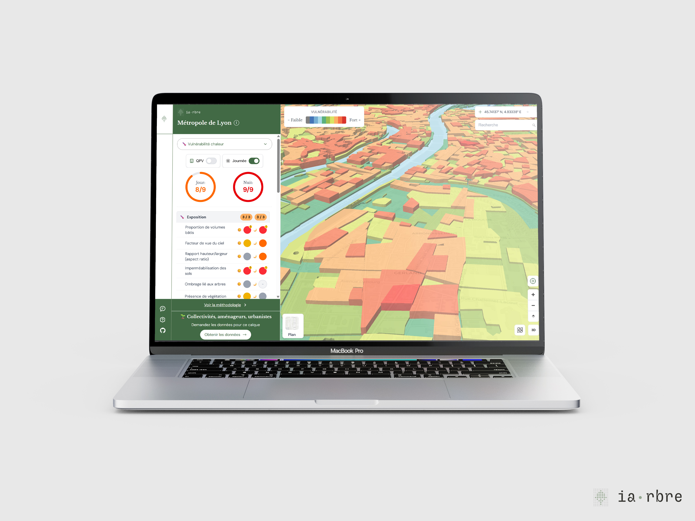

Face aux vagues de chaleur, comment identifier les zones les plus vulnérables de notre territoire ?

Le dérèglement climatique intensifie les épisodes de chaleur extrême. Pour aider les acteurs publics à mieux cibler les besoins d'adaptation, un calque de vulnérabilité à la chaleur a été conçu pour la Métropole de Lyon.

📊 La donnée a été produite par Maurine Di Tomasso, cheffe de projet Plan Climat à la Métropole de Lyon, à partir d'une méthodologie de l'Institut Paris Région, qu'elle a adaptée et simplifiée pour une lecture locale au territoire de la Métropole de Lyon.

Chez TelesCoop, nous avons conçu une interface cartographique interactive rendant cette donnée lisible, accessible et exploitable.

🧩 Chaque zone est cliquable et ouvre un panneau de contexte détaillé, permettant d'explorer les trois dimensions de la vulnérabilité à la chaleur :

- **L'exposition**
    - **La difficulté à faire face**
    - **La sensibilité**

 👉  La légende permet également de filtrer les scores, pour affiner l'analyse selon les besoins.

Un outil d'aide à la décision pour identifier les secteurs les plus sensibles face à la chaleur, et ainsi mieux orienter les politiques d'adaptation urbaine et climatique.

🔍 👉 Découvrez la carte ici : [calque de vulnérabilité à la chaleur](https://carte.iarbre.fr/vulnerability/14/45.75773/4.85377)

**📢 Votre avis compte !**

Vous avez testé la carte ? Aidez-nous à l'améliorer en répondant à ce court questionnaire de retour :

👉[ https://form.typeform.com/to/BoaUke15](https://form.typeform.com/to/BoaUke15)
