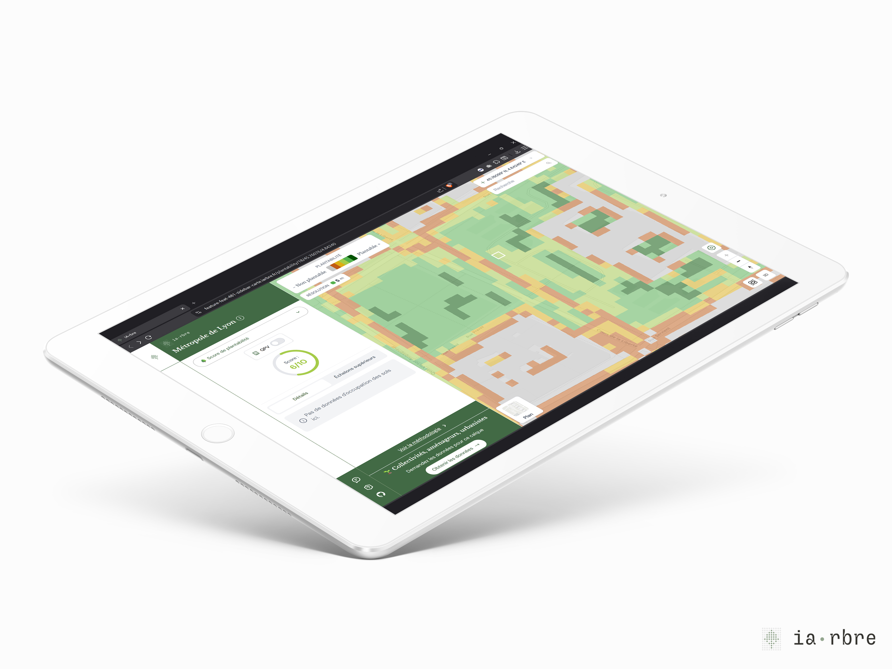
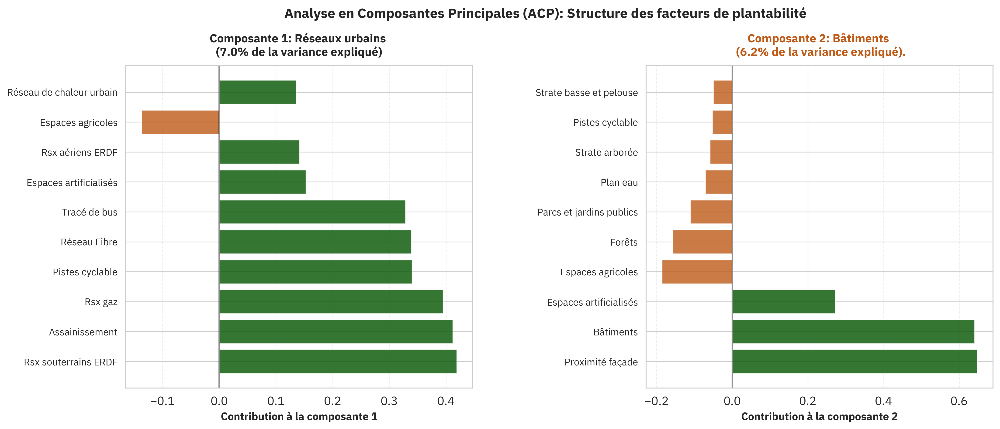
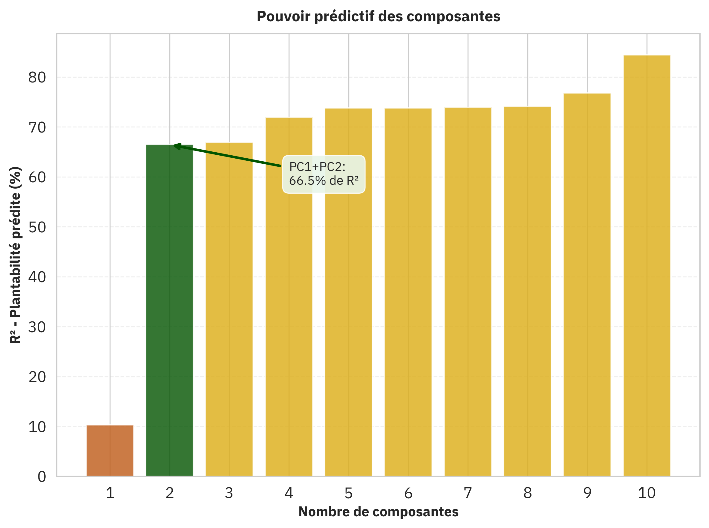

## L'origine du calque

La question intiale posée aux gestionnaires d'espaces publics était _"Qu'est ce qui fait qu'il est facile ou difficile la plantation sur l'espace public ?"_. Cette interrogation a permis de d'identifier un certain nombre de **facteurs.**

Un travail collaboratif a ensuite été mené avec ces mêmes gestionnaires pour pondérer chaque facteur sur une échelle entre `-5` et `+5`. `+5` étant un facteur très favorisant et `-5` un facteur absolument bloquant. Par exemple, un parking est un facteur bloquant mais pas absolument bloquant comme peut l'être un bâtiment ou le fleuve Rhône.
Ces facteurs ont ensuite été traduits en données existantes.

## Influence des facteurs sur le score de plantabilité

Avec 35 facteurs distinces,l'analyse directe s'avère complexe. Pour simplifier, nous avons appliqué sur les données une [analyse en composantes principales (ACP)](https://fr.wikipedia.org/wiki/Analyse_en_composantes_principales). L’ACP permet d’identifier des groupes de facteurs corrélés, qui agissent ensemble (ou en opposition). Dans une second temps, nous analysons leur lien avec la plantabilité.

### Les axes principaux dans les données

L’ACP a permis de définir de nouveaux axes, des combinaisons linéaires de facteurs, qui conservent l’essentiel de l’information tout en étant indépendants les uns des autres. Ces axes révèlent des groupes de facteurs expliquant la structure des données, indépendamment de la plantabilité.

**Premier groupe (7 % de la variance)** : Ce groupe est principalement lié aux **réseaux urbains** :

- Réseaux souterrains (ERDF, assainissement, gaz),
- Réseaux de transport en surface. Les espaces agricoles y apparaissent avec une contribution négative, indiquant une évolution opposée aux autres variables.

**Deuxième groupe** : Les variables dominantes sont les **bâtiments** et les **façades**.

Ces résultats mettent en évidence deux types de zones prédominantes dans les données :

- Les zones à forte densité de réseaux urbains,
- Les zones bâties.

Cela n'est pas surprenant, étant donné que l'étude porte sur la Métropole de Lyon.

### Prédiction de la plantabilité

En se basant uniquement sur les **deux premières composantes principales** (qui combinent chacune une dizaine de facteurs), **66% du score de plantabilité** est expliqué. L'ajout de composantes supplémentaires apporte des gains moindres en termes d'explicabilité.

**La composante 2,** liée aux bâtiments, est celle qui influence le plus la plantabilité. Cela signifie que le **bâti** est le principal obstacle à la plantation d'arbres sur les **533,7 km²** de la Métropole de Lyon, suivi par les **réseaux urbains,** qui constituent un frein supplémentaire.
