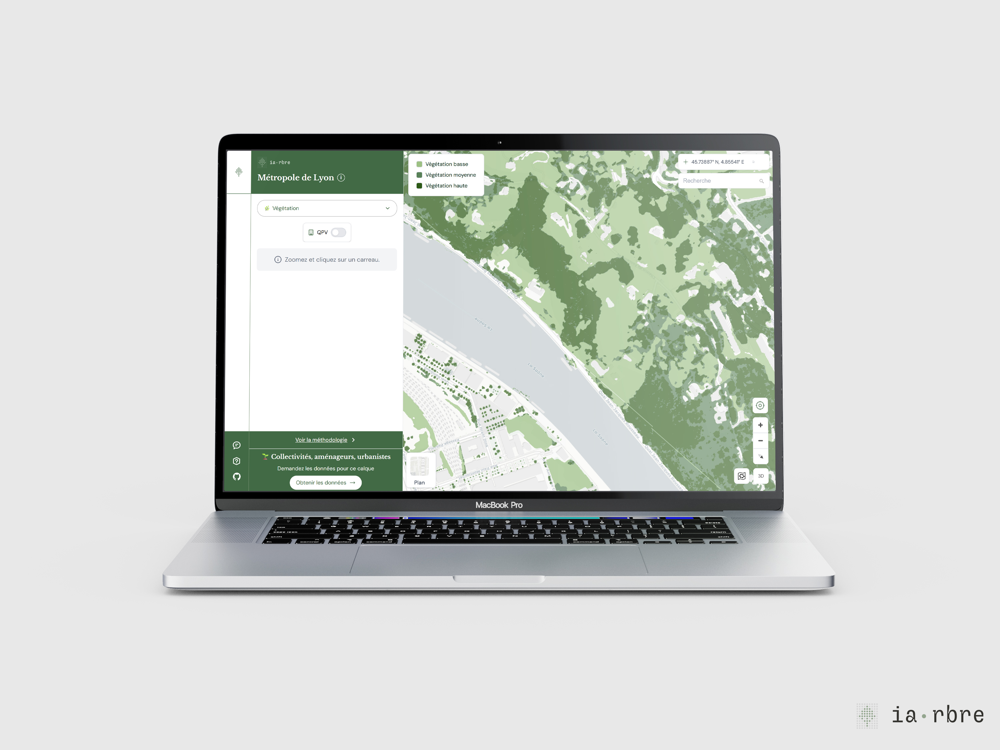

# **1.  Ce que la carte calcule**

**IA·rbre propose deux types d’informations superposables :**

- Un **score de plantabilité** : une valeur entre 0 et 10 est attribuée à chaque tuile de 5×5 mètres du territoire. Elle synthétise 35 facteurs (réseaux souterrains, infrastructures de transport, espaces verts existants...) pondérés lors d’ateliers avec les services terrain de la Métropole de Lyon en 2022.
- Un **atlas de vulnérabilité à la chaleur** : une cartographie des zones les plus exposées aux épisodes de chaleur intense, croisant données sociales (INSEE), morphologie urbaine et zones climatiques locales (LCZ).

IA·rbre propose aussi une carte exclusive :

- Un **inventaire du végétal** découpé en 3 strates (haute, moyenne et basse) produit à partir du LIDAR métropolitain 2023 et des orthophotos métropolitaines 2023

> 📌 Note technique : Le score de plantabilité est calculé à une résolution de 5×5 mètres. Ce n’est pas anodin : à cette échelle un réseau ENEDIS peut faire basculer le score d’une parcelle. La précision est une force et une limite à la fois.

# 
2. Ce que la carte ne calcule pas

**C’est peut-être la question la plus importante à poser avant d’utiliser l’outil.**

Le score de plantabilité ne dit pas _où_ un arbre doit être planté. Il dit _si_ l’occupation du sol permet d’y planter techniquement un arbre. La différence est considérable. Un score élevé sur une parcelle ne préjuge ni de sa valeur d’usage, ni des arbitrages politiques locaux, ni de l’acceptabilité sociale d’une intervention. De même, la carte ne capte pas ce qui n’est pas dans les données : les usages informels d’un espace, les conflits d’usage latents, la mémoire d’un lieu. Ces éléments appartiennent au terrain, à des décisions et orientations politiques et IA·rbre ne prétend pas les modéliser.

# 3 - Une donnée datée et précise

Les scores affichés sur la carte ont été calculés en **juillet 2025** à partir des données les plus récentes disponibles sur Data Grand Lyon. Cependant, certaines couches restent figées à des millésimes antérieurs :

- Réseaux GRDF/ENEDIS : données **2022**
- Espaces verts (EVA) : données **2015**

Ces données n’avait pas de version open data plus récente au moment du calcul. L’utilisateur est invité à calibrer son niveau de confiance en fonction de l’ancienneté de ces couches, en particulier sur des zones ayant connu des travaux d’infrastructure depuis 2022.

> ⚠️ En pratique : Si vous travaillez sur un secteur ayant fait l’objet de travaux de voirie ou de réseaux récents, croisez systématiquement le score IA·rbre avec vos données internes avant toute décision.

# 4 - Un outil de délibération, pas d’arbitrage

La question qui revient le plus souvent lors des présentations d’IA·rbre est la suivante : _"Est-ce que la carte me dit où planter en priorité ?"_ La réponse est : pas directement. Ce qu’elle offre, c’est une base commune pour poser la question différemment et pour la poser à plusieurs, avec les mêmes données sous les yeux. C’est peut-être là sa valeur la plus durable : non pas trancher, mais outiller la délibération.

👉 Pour aller plus [loin](https://erasme.notion.site/Lire-le-score-de-plantabilit-33444e49a3ad8080bb66f23ad06bb6a1?pvs=74).
