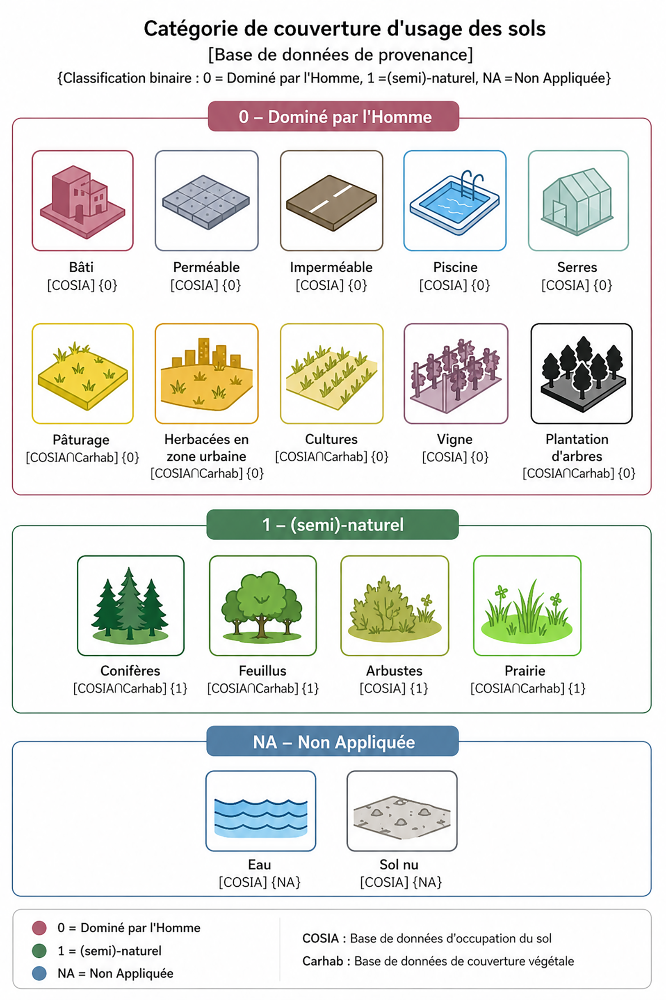

## Un ancrage dans les limites planétaires

En 2009, une équipe internationale du _Stockholm Resilience Centre_ a défini neuf indicateurs
pour mesurer l’impact de l’activité humaine sur les grands équilibres de la planète. Parmi ces neuf limites planétaires, la destruction de la biodiversité est l’une des plus critiques — et l’une des plus difficiles à traduire à l’échelle locale.

Les neuf limites sont : 

1. le changement climatique,
2. la destruction de la biodiversité, 
3. l’utilisation massive d’engrais (azote et phosphore), 
4. le changement d’usage des sols (déforestation), 
5. le cycle de l’eau douce,
6. le rejet de nouvelles substances dans la nature,
7. l’acidification des océans, 
8. l’appauvrissement de la couche d’ozone, 
9. et l’augmentation des particules dans l’atmosphère.

> 📌 **Le problème de l’échelle** : Ces limites sont définies à l’échelle de la planète. Elles disent ce que la Terre peut absorber dans son ensemble. Elles ne disent pas ce qu’un territoire de 500 km² comme la Métropole de Lyon doit préserver pour maintenir ses propres fonctions écologiques. C’est précisément ce que l’indice fonctionnel de biodiversité cherche à résoudre.

  ---

## Ce que l’indice mesure : et pourquoi ces fonctions ?

Une équipe de chercheurs de l’École des Mines de Saint-Étienne (UMR 5600 : Environnement Villes et Sociétés) a travaillé avec le service Climat et Résilience de la Métropole de Lyon pour proposer un indicateur **fonctionnel local de la biodiversité**.

L’enjeu n’est pas de mesurer la biodiversité en tant que telle, le nombre d’espèces présentes, la richesse spécifique, mais de mesurer si le territoire dispose d’assez d’espaces naturels pour que la biodiversité puisse remplir ses fonctions concrètes pour les habitants et les écosystèmes :

- Pollinisation
- Impact positif sur la santé des habitants
- Régulation des maladies et ravageurs
- Maintien de la qualité de l’eau douce
- Préservation des sols contre l’érosion

> 📌 **Une base scientifique solide** : l’indicateur s’appuie sur une étude publiée dans _One Earth_ ([Mohamed et al., 2024](https://www.cell.com/one-earth/fulltext/S2590-3322(23)00564-X)), elle-même issue d’une revue systématique de plus de **4 000 publications** en écologie et en santé. Le résultat est une cible claire : un minimum de **20 à 25 % d’espaces (semi)-naturels dans le km² environnant** est nécessaire en tout point d’un territoire pour maintenir ces fonctions écologiques.

  ---

## Comment l’indicateur est calculé ?

### Étape 1 : Trouver les bonnes données de couverture des sols

Pour savoir si un sol est naturel ou dominé par l’activité humaine, il faut une source de données à la fois précise et suffisamment fine pour détecter une haie, un alignement d’arbres ou un jardin de quelques mètres carrés.

Émile Balembois, doctorant au laboratoire EVS des Mines de Saint-Étienne, a identifié deux critères non négociables pour le choix des données :

- Une r**ésolution de l’ordre du mètre**, suffisante pour repérer des éléments végétaux isolés (arbres individuels, haies, bandes enherbées).
- La capacité à **distinguer les espaces semi-naturels** (une plantation d’arbres, un parc aménagé) des espaces entièrement naturels (une forêt, une ripisylve, une zone humide).

Ce sont finalement deux sources produites par l’IGN qui ont été retenues :

| Source | Ce qu’elle décrit |

| [COSIA](https://geoservices.ign.fr/sites/default/files/2025-01/Cosia_Documentation_Technique_IGN_2023.pdf) | Couverture et usage des sols à haute résolution |

| [CarHab](https://geoservices.ign.fr/actualites/2025-03-carhab) | Cartographie des habitats naturels et semi-naturels |

  ---

### Étape 2 : Classer chaque mètre carré en binaire

A partir de ces deux sources de données le territoire de la métropole de Lyon a été classée en 

**0 = dominé par l'Homme** et  **1 = naturel avec une carroyage de 4mx4m.**

