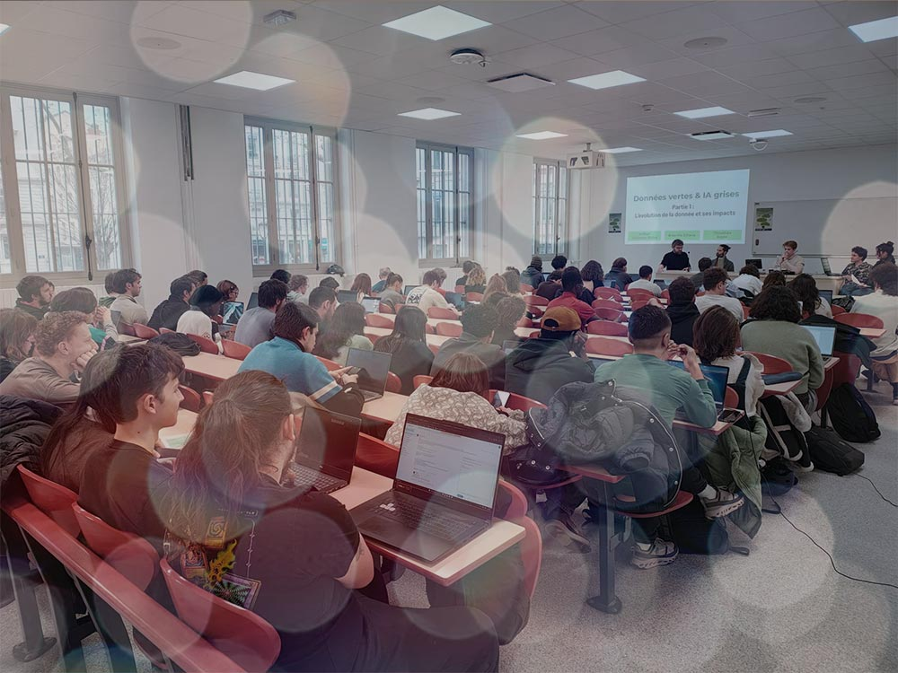

Arthur Villarroya-Palau, ingénieur d’étude au LIRIS pour le projet IA.rbre a participé à ce séminaire annuel.

La thématique proposée cette année étant **« Données vertes, IA grise : la géomatique face à ses contradictions environnementales”,** ce temps particulièrement intéressant était l’occasion de discuter de la démarche portée par IA.rbre dans un contexte d’évolution de l’usage de l’IA. Arthur a pu présenter la vision du projet, les pratiques et posture d’une IA frugale dans le domaine de l’innovation, entouré d’un panel mobilisant également l’IGN et le laboratoire EVS sur le programme CarHab.

Un résumé sera bientôt disponible sur le site du [master Géonum](https://mastergeonum.org/).
